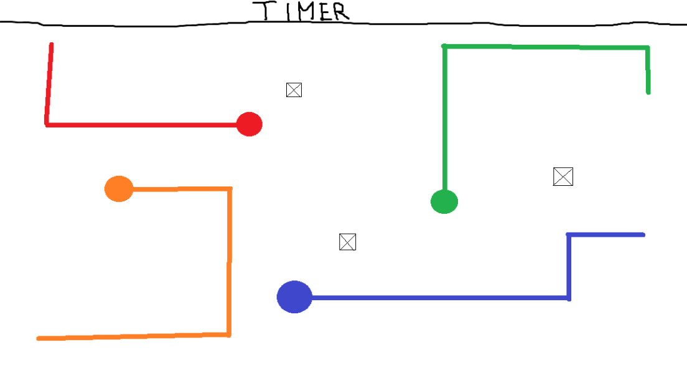
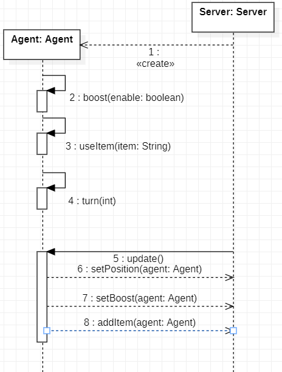

# Flash Siklik
FLash Siklik est un jeu multijoueur inspiré de Tron utilisant les serveurs Pytactx.

## 🎯 Contexte & cahier des charges
Développé dans le cadre d'une formation, pour un formateur pour monter en compétence en Python ...

## 🎲 Règles du jeu

*Maquette du jeu*

Chaque joueur contrôle une moto laissant une trainé de couleur formant un mur derrière elle.
Un joueur est eliminé lorsqu'il percute un mur. Une partie dure X minute(s).
Un joueur peut gagner de différente manière :
- Le joueur est le dernier en vie
- Le joueur a le plus d'elimination a la fin de la partie
- Le joueur est le dernier en vie dans la phase mort subite
Une phase mort subite est déclanchée si plusieurs joueurs ayant le même nombre d'éliminations sont encore en vie à la fin de la partie.

## 🎮 Use cases
<b>En tant qu'administrateur je peux :</b>
<ul>
    <li>Decider de qui a accès au serveur</li>
    <li>Modifier la taille de la carte</li>
    <li>Modifier en direct les caracteristiques d'un agent</li>
</ul>

<a href="./src/api/README.md#useCases"><b>En tant que joueur je peux</b></a>
## ⚙️ Diagramme de classes
[](https://mermaid.live/edit#pako:eNq1VcFuo0AM_ZXRnFqV_ADqJRLaag-tqrbaU6TKCw4ZMTOgGdPdKMq_r2cgCZCiqtuUC-Bn-_nZHtjJvC5QpjLX4H2moHRgVlbwtSzRkrhdLESGQJul-60I3RT7SWhmoDunihnoUcMW3X39hn7G40UZdO9gqbhRfIMSJ9ZncsqWgl-LUUQI8PdgDOir67HdAOHBFvWPlO46QIhFx_H6CuF-tBYqJ7Hm1M3U1KnzB_NNpbT-hRuVa7zyqNeJiJkewOD10SnfYF79qF0ky1AjqdpG95OPR7rjoAwI-kSRPzlxnnzbpgjyBgn2Q6WDuV1O6Ex9AwEN_LGBeiLsg2IHm3S5Yl2rcenQHkqtcJuIN9DtcCiOFwK7yEnJJdIT2BInZp4xuJ5qHuopm_gy8eDSvzB2ZRWFds328vzo7T7fvL7577Q-mjwfRoTKT-Ybgx5rr753tYefjv_X1mwJcvq7HEkMn56idRAEjIyewFEg5gfTjCCHBngqtgzwSW8IOO9B1ifve0BBSio4zWjxjkRdgugwWswh5TnJLLyXiWRCRgv-JcTerSRtkOuWKT8W4KqVXNngBy3Vz1uby3QN2mMiu6n0v5Deuv8HBVwEaw)

## 📞 Diagramme de séquence
[](https://mermaid.ink/svg/pako:eNqtVW1v2jAQ_iveSZNSKUUEkhAiUQmtUoU0pmlTv6zphxs5qLXEzhxnK0X89zmBDRJeCiv5ZJ-f5_H57nK3gImMCULI6WdBYkK3HGcK00gw82WoNJ_wDIVm9zmpXetM8fgLTUkRDWck9C4iJtRPxyFZgnNSY_mL8uNArimtI1aY0rfrm5umMyFLkQvr6i8skTJjI8E1x4S_oOZyfVB-TfJePW7Id8Zaah4k7mVa03yMmc2m-efqtfmWwkH3c9J3mNItajyBvxPpcwUO5OFcmWaWTuKTiF_NpioSGioSaEWQYhZBKWPU6gkem5yzj2Z1imMZ_hYjY7bOiEaRxajJOikBB7G7vmygGzAmmkXwQYqYl9VqCpC9Zx02GLA2QxGb7bsBc9oRbCj_G8FtfhXH-8oftk5THfDqJSuWhaXlk0m9bZ7xXF5XWYZaK_690JQ_VObHqwvIz_fLz3flq1r7t0lyasZ4cFZQZ6vqHompzK3GVW9vDpdoEBdpEhdsFG9tFpeo862Gc1Sq_gdXLLAhJWVmS2wG56I8iEA_UUoRhGYZo_pRFs_S4LDQ8utcTCDUqiAbVmrrIQvhFE312WCG2zcpa3sIF_AMoeP2W0E38Pv9rtsOOu2uDXMIr50gaPltz-t5nu94na7rLm14qSScVqcXBJ4T9IOe7_t917WBTGlLk69q0lcDf_kHgDmNmA)

<!-- Expliquer les points suivants
- [ ] les acteurs
- [ ] le déroulé d'une partie en partant des use case
- [ ] les données échangées entre chaque couche
- [ ] les algorithmes
- [ ] les machines
- [ ] les protocoles réseaux -->

## ✅ Pré-requis 
**Pour l'administrateur**
- Un ordinateur connecté à internet avec python 3.10 d'installé
- Avoir un accès à un serveur privé play.jusdeliens.com

<a href="./src/api/README.md#preRequis"><b>Pour les apprenants</b></a>

## ⚙️ Installation
Execution du script d'installation fourni sur la racine du projet.

## 🧪 Tests
- Lorsqu'un agent avance, un mur se crée derrière lui
- Lorsqu'un agent fonce dans un mur, celui-ci est eliminé

## 🛣️ Roadmap
tout.

## 👨‍💻 Auteur(s)
BELLAN Tristan, CHERUEL Baptiste, DUVAL Theo, BOUCHAUD Hugo

## ⚖️ License
Under CC BY-NC-ND 3.0 licence
https://creativecommons.org/licenses/by-nc-nd/3.0/
