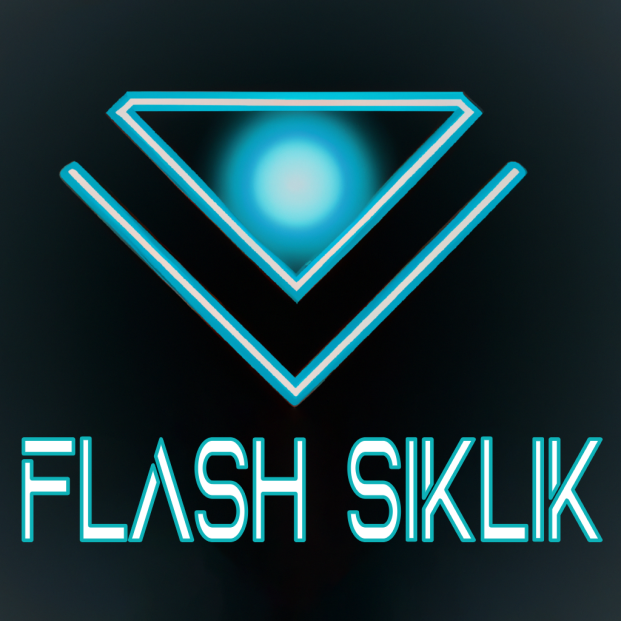

# Flash Siklik
FLash Siklik est un jeu multijoueur inspiré de Tron utilisant les serveurs Pytactx.

## 🎲 Règles du jeu 
Chaque joueur contrôle une moto laissant une trainé de couleur formant un mur derrière elle.
Un joueur est eliminé lorsqu'il percute un mur. Une partie dure X minute(s).
Un joueur peut gagner de différente manière :
- Le joueur est le dernier en vie
- Le joueur a le plus d'elimination a la fin de la partie
- Le joueur est le dernier en vie dans la phase mort subite
Une phase mort subite est déclanchée si plusieurs joueurs ayant le même nombre d'éliminations sont encore en vie à la fin de la partie.

<h2>🎮 Use cases</h2>
<b>En tant que joueur je peux :</b>
<ul>
    <li>Changer ma direction</li>
    <li>Booster ma vitesse</li>
    <li>Utiliser un item
        <ul>
            <li>Bouclier</li>
            <li>Boost</li>
            <li>Effet fantome</li>
            <li>Destructeur de mur</li>
        </ul>
    </li>
</ul>

<h2>✅ Pré-requis</h2>
<ul>
    <li>Un ordinateur connecté à internet avec python 3.10 d'installé</li>
    <li>Avoir un accès à un serveur privé play.jusdeliens.com</li>
</ul>

## ⚙️ Installation 
Execution du script d'installation fourni sur la racine du projet.

## 👨‍💻 Auteur(s)
BELLAN Tristan, CHERUEL Baptiste, DUVAL Theo, BOUCHAUD Hugo

## ⚖️ License
Under CC BY-NC-ND 3.0 licence
https://creativecommons.org/licenses/by-nc-nd/3.0/
